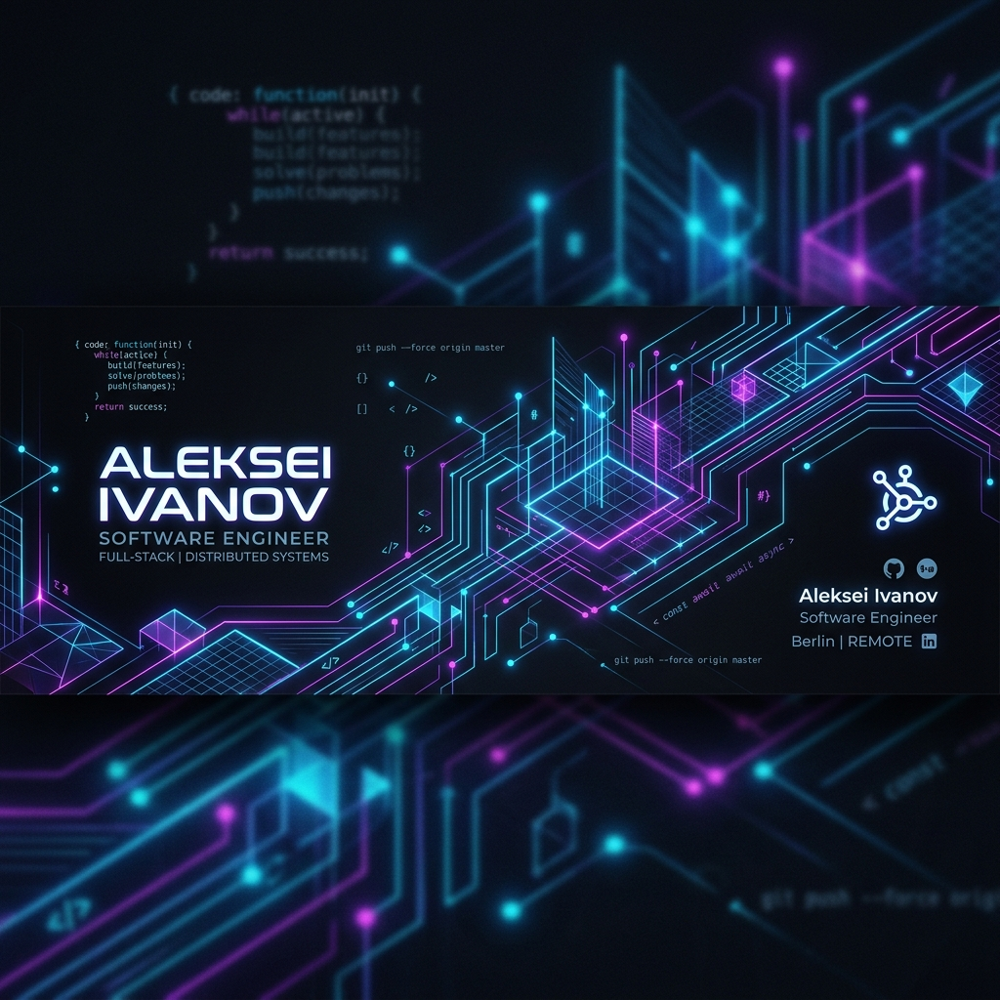

<!-- Banner -->

<!-- Typing SVG -->

  
  

---

### 💫 About Me

I am a software engineer focused on automation, AI application development, and engineering robust backend systems. I love writing clean code, designing automated workflows, and continuously expanding my knowledge base.

- 🛠️ **Currently building**: An automated workflow system for daily learning tracking.
- 📚 **Daily Focus**: Deep diving into AI models, Data Structures & Algorithms (DSA), and System Design.
- ⚡ **Fun fact**: I believe consistency combined with automation is a developer's ultimate superpower.

---

### 💻 Tech Stack

| Category | Technologies |
| :--- | :--- |
| **Languages** |     |
| **Frameworks & AI** |     |
| **Tools & Cloud** |     |
| **Databases** |    |

---

### 📊 GitHub Analytics

  <table border="0">
    <tr>
      <td align="center" width="50%">
        
      </td>
      <td align="center" width="50%">
        
      </td>
    </tr>
    <tr>
      <td align="center" colspan="2">
        
      </td>
    </tr>
  </table>

---

### 🚀 Highlighted Project

#### 📅 [Dev Daily Tracker](https://github.com/pawanesh07/dev-daily-tracker)
An automated pipeline leveraging Python and GitHub Actions to log daily learning targets (AI, DSA, and System Design) while maintaining automated contribution activity.
- **Continuous Learning**: Demonstrates proof of continuous study and discipline.
- **CI/CD Driven**: Autonomous scheduled workflow keeping repositories active and structured.

---

### 🤝 Connect with me

  
  

